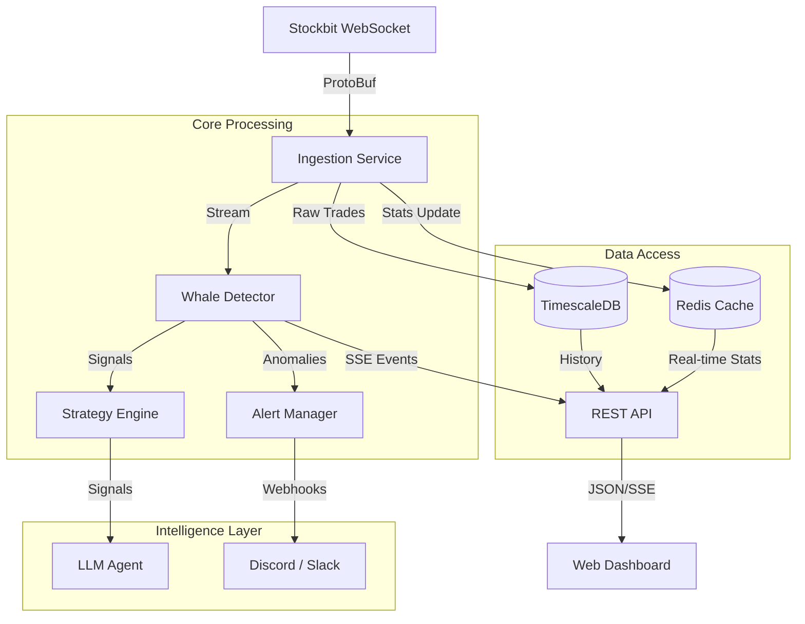

# System Architecture

The Stockbit Analysis system is a high-performance, containerized application designed for real-time stock market analysis, whale detection, and automated pattern recognition.

## High-Level Overview

## Internal Components

### 1. Data Ingestion Layer
- **Source**: Stockbit WebSocket feed (ProtoBuf format).
- **Responsibility**: Connects, authenticates, keeps connection alive, and decodes binary messages.
- **Deduplication**: Uses Redis to prevent duplicate processing of trades.

### 2. Storage Layer
- **TimescaleDB (PostgreSQL)**:
  - **Hypertables**: `running_trades` is partitioned by time for efficient insertion and querying of millions of rows.
  - **Continuous Aggregates**: `candle_1min` automatically aggregates raw trades into OHLCV bars.
  - **Retention**: Policies automatically drop raw data older than 3 months to save space, while keeping aggregates longer.
- **Redis**:
  - **Hot Cache**: Stores rolling statistics (Mean/StdDev) for the last 60 minutes for instant Z-Score calculation.
  - **Session**: Caches authentication tokens.

### 3. Analysis Engine
- **Whale Detector**:
  - Calculates Z-Score for every incoming trade against the cached rolling statistics.
  - Triggers alerts if `Z-Score > 3.0` or `Volume > 5x Average`.
- **Strategy Engine**:
  - **Volume Breakout**: Detects price surges accompanied by massive volume.
  - **Mean Reversion**: Identifies overbought/oversold conditions using statistical deviations.
  - **Fakeout Filter**: Validates breakouts using order flow analysis (HAKA vs HAKI).

### 4. Intelligence & LLM Layer
- Integrating OpenAI-compatible LLMs to provide qualitative analysis on top of quantitative data.
- **Modes**:
  - **Accumulation**: Analyzes multi-day buying patterns.
  - **Anomalies**: Explains potential reasons for extreme market moves.
  - **Timing**: Identifies optimal entry/exit times based on historical probabilities.

> Note: AI Analysis features are currently internal-only and not exposed via API.

### 5. API & Real-time Layer
- **REST API**: Standard CRUD and analytical endpoints.
- **SSE (Server-Sent Events)**: Pushes real-time alerts.

## Core Algorithms

### 1. Whale Detection Engine
The system uses a hybrid statistical model to detect anomalies.

**Formulas:**
- **Z-Score**: $Z = \frac{V_{curr} - \mu_{vol}}{\sigma_{vol}}$
- **Rel Vol**: $Vol\% = \frac{V_{curr}}{\mu_{vol}} \times 100$

**Triggers:**
- **Primary**: $Z \ge 3.0$ (Statistical Anomaly)
- **Secondary**: $Vol\% \ge 500\%$ (5x Relative Volume)
- **Fallback**: volume > 2,500 lots OR value > 1B IDR (for stocks with insufficient history)

**Confidence Scoring:**
A continuous function capped at 100%:
$Score = 70 + (Z_{score} - 3.0) \times 15 + Bonus_{vol}$
*(Base 70% at Z=3, reaching ~100% at Z=5)*

### 2. Strategy Engine
The system implements three primary algorithmic strategies:

#### A. Volume Breakout (Trend Following)
- **Logic**: Price Change $> 2\%$ **AND** Volume Z-Score $> 3.0$
- **Context**: Confidence is halved if Market Regime is **RANGING**.
- **Action**: BUY

#### B. Mean Reversion (Contrarian)
- **Logic**: Price Z-Score $< -4.0$ (Oversold)
- **Context**: Confidence boosted (1.2x) in **RANGING** or **VOLATILE** markets.
- **Action**: BUY

#### C. Fakeout Filter (Defensive)
- **Logic**: Price Breakout ($>3\%$) **BUT** Weak Volume ($Z < 1.0$)
- **Action**: NO_TRADE (Filters out false moves)

### 3. Position Management
Automated rules for signal lifecycle:

- **Entry**: Max 10 positions globally, 1 per symbol. 15-min cooldown between signals.
- **Stop Loss**: Hard stop at **-2%**.
- **Take Profit**:
  - **Dynamic**: If Profit $> 1\%$ AND Sell Pressure $> 60\%$ (Momentum Reversal).
  - **Hard Limit**: $+5\%$.
- **Time Exit**:
  - **Pre-Close**: Profit taking allowed 14:50-15:00.
  - **Force Exit**: All positions closed at 16:00 WIB.

## Key Enhancements (Phases 1-3)

1.  **Signal Persistence**: All generated signals are now stored in `trading_signals` with lifecycle tracking in `signal_outcomes`.
2.  **Order Flow Analysis**: Real-time calculation of Aggressor Buy (HAKA) vs Aggressor Sell (HAKI) to determine true market sentiment.
3.  **Market Regimes**: Automatic classification of market state (Trending, Ranging, Volatile) to adjust strategy sensitivity.
4.  **Follow-up Tracking**: Automatically monitors price action 1min, 5min, 1hour, and 1day after a whale alert to measure signal quality.
